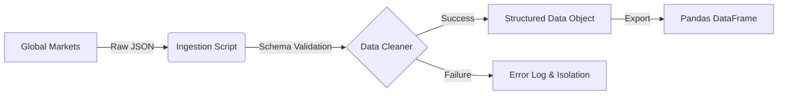
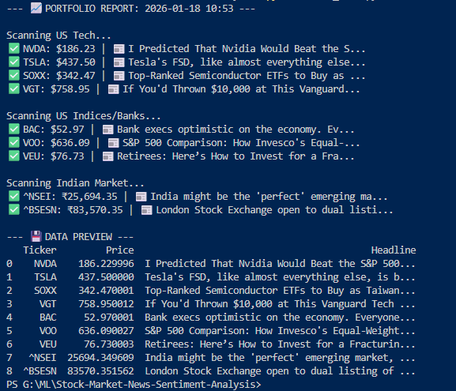

# 🏦 Market Sentiment Intelligence Pipeline
### Phase 1: Ingestion Microservice

> **Architecture Status:** `v0.1.0-alpha` (Ingestion Layer Stable)  
> **System Latency:** ~1.2s per fetch cycle  
> **Data Integrity:** Schema-Validated JSON Parsing

---

## 🏗️ System Architecture
This project is not just a stock tracker; it is an **Automated ETL (Extract, Transform, Load) Pipeline** designed to quantify the correlation between unstructured news data and financial asset performance.

**Current Module: `Ingestion Node`**
Responsible for establishing fault-tolerant connections to global financial data providers, normalizing multi-currency assets, and handling proprietary API schema changes dynamically.


📊 Sample Output

The script generates a real-time console report and prepares a DataFrame for the next phase.


🛠️ Operational Commands

1. Deployment (Local)
```
# Clone & Install Dependencies
git clone [https://github.com/kanishk2705/Stock-Market-News-Sentiment-Analysis.git](https://github.com/kanishk2705/Stock-Market-News-Sentiment-Analysis.git)
pip install -r requirements.txt
```
2. Execution (Ingestion Layer)
```
python fetch_data.py
```
3. Diagnostics If the upstream API changes, run the inspector tool to reverse-engineer the new payload:
```
python debug_news.py
```
🛣️ Roadmap & Future Phases

| Phase | Module | Tech Stack | Status |
| :---: | :--- | :--- | :--- |
| **I** | Ingestion Layer | Python, yFinance, Pandas | ✅ **Stable** |
| **II** | NLP Transformation | HuggingFace, FinBERT, PyTorch | 🔄 **In Progress** |
| **III** | Persistence Layer | PostgreSQL / SQLite | ⏳ **Planned** |
| **IV** | Visualization Node | Streamlit, Plotly | ⏳ **Planned** |